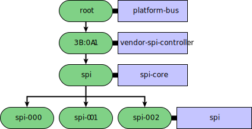
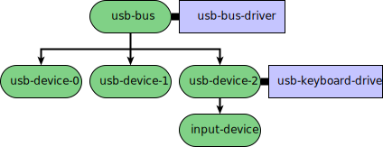
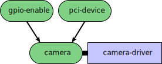

# Drivers and nodes

Important: This page contains information that is specific to the new
version of the driver framework (DFv2).

In Fuchsia, every driver is bound to a node. A node is the main building block
of the [driver framework][driver-framework]. A node can be thought of as
a hardware or virtual device, or a node can be a part of a hardware device.
For example, a GPIO node can represent a single GPIO pin attached to a GPIO
controller while a RAM disk node can represent a virtual disk, not a real
hardware device.

Drivers, when bound to nodes, can create child nodes. As a result, nodes form a
directed acyclic graph representing all known hardware and virtual devices in a
Fuchsia system.

**Diagram 1**. A node topology where the green circles are nodes representing
devices and the blue boxes are drivers.

## Node properties

A node has the following properties:

*   [Binding properties][binding-properties]: Key-value pairs that describe
    which driver can [bind][driver-binding] to the node. The keys can be of
    integer or string type. The values can be of integer, string, boolean,
    or enum type.
*   [Capabilities][capabilities]: FIDL capabilities that are offered to a driver
    when it is bound to the node. These can be both in-process and
    out-of-process capabilities.
*   [Symbols][symbols]: Key-value pairs where the keys are strings and the
    values are virtual addresses. A driver uses these symbols to hand pointers
    to a child driver for [in-process communication][driver-runtime]. The
    symbols are only provided to a driver if it is co-located in the same
    [driver host][driver-host] as its parent, otherwise the driver uses FIDL
    calls to communicate.

A driver creating child nodes gets to assign binding properties, capabilities,
and symbols to the new nodes.

## Node capabilities

A node represents a collection of resources, which in turn represents a hardware
or virtual device in a Fuchsia system. When a parent driver creates a new node,
the parent driver specifies which capabilities are associated with that node.
When a child driver binds to that node, the driver framework routes the
capabilities associated with the node to the incoming namespace of
the child driver.

However, not all capabilities in a driver’s incoming namespace are from a parent
driver. Some capabilities may come from non-driver components in the system.

## Node topology

Fuchsia's [driver manager][driver-manager] maintains a node topology that
describes the parent-child relationships between nodes (representing devices)
in a Fuchsia system. Starting with the root node, the driver bound to the root node creates
child nodes – there’s no limit on how many children a node can have. The drivers
that are bound to these child nodes often create their own children. As a
result, these nodes form a single node topology, expressed
in a directed acyclic graph, which describes all the hardware
and virtual devices discovered in a Fuchsia system.

**Diagram 2**. Example of a USB bus topology.

In the example above, the USB bus driver (`usb-bus-driver`) is bound to a node
(`usb-bus`) representing the USB bus. The driver then creates a child node for
every new USB device discovered in the system. Depending on the node’s
properties, each USB device node can have a specific USB driver bound to it.
For instance, the USB keyboard driver (`usb-keyboard-driver`) is bound to one of
the USB device nodes. From which, we can guess that the `usb-device-2` node
likely represents a keyboard device connected to the system through a USB port.

### Comparison to the component topology

Similar to the driver framework, the component framework has its own
[topology][component-topology] where components can declare children. However,
the node topology and the component topology are kept separate. The first reason
is that not all nodes may have drivers bound to them. This means that these
unbound nodes are not associated with any specific components shown in the
component topology. In fact, many nodes in the node topology are commonly left
unbound (that is, unmatched with drivers) while the system is running. Second,
in the node topology a node may have multiple parent nodes (see
[Composite nodes](#composite_nodes)), which isn’t allowed in the component
topology.

From the component framework’s perspective, the drivers’ topology appears to be
flattened. The driver framework keeps the drivers in three flat
collections of components: the boot collection, the package collection, and the
universe package collection. In the component topology, all driver components
appear to be siblings of each other under their parent component, which is the
driver manager.

**Diagram 3**: The component topology showing driver components in three collections

However, unlike other components in the component topology, the driver framework
is responsible for setting a driver component’s [moniker][moniker]. The driver
framework names the moniker of a driver component based on the driver’s place
in the node topology, not the component topology. For instance, a PCI driver’s
component moniker may look like `/bootstrap/boot-drivers:root.sys.platform.pci.00_14_0`.
This component moniker implies the following node topology for the PCI driver:
`root` -> `sys` -> `platform` -> `pci` -> `00_14_0`. The component moniker shows
that this PCI driver component is only 2 layers down in the component topology,
but the node (`00_14_0`) bound to the PCI driver is 5 layers down
in the node topology.

## Node lifecycle

A driver’s lifetime in a Fuchsia system is tied to the lifetime of the node it’s
bound to.

A driver can perform the following lifecycle actions on a [`Node`][node-object]
object it controls:

*  [Create a child node](#node_creation) with specific binding properties and
   capabilities.
*  [Drop the node](#node_removal), which causes the driver manager to clean up
   the node and its descendents in the node topology.

### Node creation

A node is created when the [`AddChild`][addchild] FIDL method is called on an
existing node. Either the driver that owns the existing node or another driver
that has access to the node object can trigger a child node creation
on the node.

When a driver creates a child node, the driver can take the following actions:

*   Give the child node [properties](#node_properties) that determine which
    drivers can bind to the node.
*   Give the child node [capabilities](#node_capabilities) that later can be
    used by a driver bound to the node.
*   Keep the child node’s [`NodeController`][node-controller] object, which
    allows the parent driver to stop the child node.

When a driver creates a child node, the driver has the option of owning that
node. To own the child node, the driver adds an extra argument to the
`AddChild` call. If the driver requests to own the child node, the driver
framework doesn't bind a new driver to the node. However, if the child node is
not owned by the driver, the driver framework attempts to find a different
driver that can bind to the new node.

When a driver creates a child node, the driver also has the ability to hold on
to a [`NodeController`][node-controller] object of the child node. The driver
can use this object (by calling [`Remove`][fidl-remove]) to stop the child node
at any time, which results in stopping the driver bound to the node. The driver
receives the [`OnBind`][fidl-onbind] FIDL event through this object when
the child node is bound to a driver.

### Node removal

A node removal takes place when one of the following event occurs:

*   The driver bound to the node drops its `Node` object.
*   A node (for instance, the parent node) calls the `Remove` method on the
    target node’s `NodeController` object.
*   The component framework shuts down the driver component, therefore removes
    the driver bound to the node.

In the directed acyclic node graph, nodes are removed from the bottom first.
Before a node is removed, if the node is bound to a driver, the driver is
stopped. If a node to be removed is in the middle of the node topology, the
driver framework ensures that all the child drivers are stopped and all the
child nodes are removed before the target node is removed.

## Composite nodes

The driver manager creates a composite node when a driver wishes to
bind itself to multiple parent nodes. In this case, the driver manager adds
the composite node to each parent node as a child node. The driver manager then
binds the driver to the composite node.

A composite node has composite bind rules, which enables the driver to specify
a different set of bind rules for each parent node. A composite node’s
capabilities are forwarded from each parent node, enabling the driver to
access the combined capabilities of the parent nodes. However, bind
properties are not forwarded from the parent nodes to the composite node. In the
case of a composite node creation, the driver framework creates a composite
node in response to a driver binding to multiple parent nodes, so it already
knows the driver that will be bound to the node.

A camera may be created with a composite node as shown below:

**Diagram 4**. Representation of a composite node.

In the example above, a camera device is discovered in a Fuchsia system. This
camera device has a GPIO pin that turns the camera on and a PCI device that
transfers picture data out of the camera. The [driver index][driver-index]
matches this camera device to a driver named `camera-driver`. This driver has
composite bind rules indicating that it wishes to have two parent nodes: one for
a GPIO device and the other for a PCI device. The driver manager creates a
composite node named `camera` and adds the node as a child to both the
`gpio-enable` node and the `pci-device` node. The parent nodes then forward
their capabilities to the composite node. Lastly, the driver manager binds the
`camera-driver` driver to the composite node.

**Diagram 5**. A real-world example showing a complex binding topology for a
camera controller driver

<!-- Reference links -->

[driver-framework]: driver_framework.md
[driver-manager]: driver_framework.md#driver_manager
[driver-host]: driver_framework.md#driver_host
[driver-index]: driver_framework.md#driver_index
[driver-runtime]: driver_framework.md#driver_runtime
[driver-binding]: driver_binding.md
[binding-properties]: https://cs.opensource.google/fuchsia/fuchsia/+/main:sdk/fidl/fuchsia.driver.framework/topology.fidl;l=48
[capabilities]: https://cs.opensource.google/fuchsia/fuchsia/+/main:sdk/fidl/fuchsia.driver.framework/topology.fidl;l=61
[symbols]: https://cs.opensource.google/fuchsia/fuchsia/+/main:sdk/fidl/fuchsia.driver.framework/topology.fidl;l=65
[component-topology]: /docs/concepts/components/v2/topology.md
[moniker]: /docs/concepts/components/v2/identifiers.md#monikers
[node-object]: https://cs.opensource.google/fuchsia/fuchsia/+/main:sdk/fidl/fuchsia.driver.framework/topology.fidl;l=107
[addchild]: https://cs.opensource.google/fuchsia/fuchsia/+/main:sdk/fidl/fuchsia.driver.framework/topology.fidl;l=113
[node-controller]: https://cs.opensource.google/fuchsia/fuchsia/+/main:sdk/fidl/fuchsia.driver.framework/topology.fidl;l=73
[fidl-remove]: https://cs.opensource.google/fuchsia/fuchsia/+/main:sdk/fidl/fuchsia.driver.framework/topology.fidl;l=74
[fidl-onbind]: https://cs.opensource.google/fuchsia/fuchsia/+/main:sdk/fidl/fuchsia.driver.framework/topology.fidl;l=77
