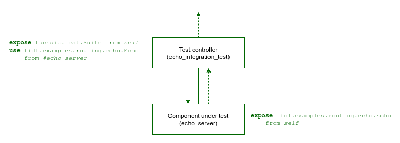

# Complex topologies and integration testing

<<../../components/_v2_banner.md>>

Integration testing scenarios involve two or more components operating in the
same realm and exchanging capabilities. While the majority of tests are unit
tests that span only a single component, integration testing scenarios call for
defining realm topologies and capability routes.

In cases where the components in the test are static, the "driver" pattern
should be used to create a statically defined topology for the test.
In cases where realm topology needs to be defined at run time, or components
need to be mocked out, [Realm Builder][realm-builder] should be used.

## The "driver" pattern for v2 component tests

We demonstrate the driver pattern for writing an integration test with a custom
component topology.

### Build definition

We define the `BUILD.gn` file as shown below:

```gn

```

### Component topology

The topology for the test realm in this example looks as follows:

<br><br>

In this example the test package `echo_integration_test` contains three
components:

- **echo_integration_test** - Main entry point
- **echo_server** - Component under test
- **echo_integration_test_driver** - Test driver

`echo_integration_test` has two children:

- **echo_integration_test_driver**
- **echo_server**

This is a simple component realm that launches `echo_server` and
`echo_integration_test_driver`, and routes `fidl.examples.routing.echo.Echo`.

Finally, note that all components under test are included in the test's own
package. This promotes hermeticity and has many benefits. For instance it's
possible to push an updated version of the same package to the device and run
the test again without worrying whether the different components are all of the
same version or have fallen out of sync.

### Test Runner Framework integration

Note that the driver component exposes `fuchsia.test.Suite` from its child to
the test root. The root of a test realm must always expose this protocol in
order to integrate with the [Test Runner Framework][trf].

The root realm is defined as follows:

```json5

```

`echo_integration_test_driver` contains the test logic and expectations.
The driver connects to the echo server and verifies it responds with an echo.

Note that this is a Rust test, and therefore includes `rust/default.shard.cml`
as required to integrate with the [Test Runner Framework][trf].

```json5

```

### Further study

The code for this example can be found under
[`//examples/components/routing/integration_tests`][driver-pattern-example].

[driver-pattern-example]: /examples/components/routing/integration_tests/
[trf]: test_runner_framework.md
[realm-builder]: /docs/development/components/v2/realm_builder.md
