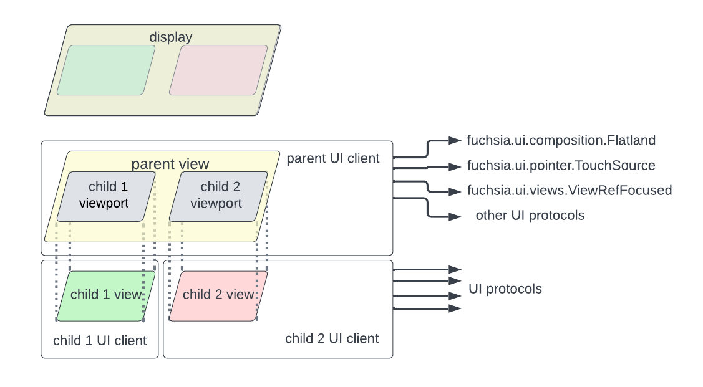

# User interface client

Throughout this documentation, a "user interface client" refers to code that
creates a graphical user interface and responds to input events, such as mouse,
touch, and keyboard.

## A UI is composed with multiple APIs

These UI functions are divided between a number of FIDL APIs to serve a
broad spectrum of [constituents](/docs/contribute/governance/api_council.md#values);
hence there is no single "UI API". Instead, a client implements its UI using
the APIs it needs.

Some examples include:
  * [fuchsia.ui.composition.Flatland](/sdk/fidl/fuchsia.ui.composition/flatland.fidl) for views and graphics
  * [fuchsia.ui.views.ViewRefFocused](/sdk/fidl/fuchsia.ui.views/view_ref_focused.fidl)
    and [Focuser](/sdk/fidl/fuchsia.ui.views/focuser.fidl) for view focus management
  * [fuchsia.ui.pointer](/sdk/fidl/fuchsia.ui.pointer) for mouse and touch
  * [fuchsia.ui.input3.Keyboard](/sdk/fidl/fuchsia.ui.input3/keyboard.fidl) for keyboard

## A UI client has a View to place graphical content

A UI client creates a [view](/docs/glossary#view) in the global view tree, and
within that view, presents graphical content to the user via a display.

A view is the common unit of UI organization between UI clients on Fuchsia. For
example, a view can embed other views in a parent-child relationship, which
recursively creates the view tree. At the top, the root view attaches to the
display.

## A UI client receives input events and reacts appropriately

The Fuchsia platform may send a UI client a sequence of input events initiated
by a user. Typically these input events are directed at the UI client's view. A
UI client is then responsible for reacting to input events that are directed to
its view; for example, it can update its graphical content based on a mouse
click event.
