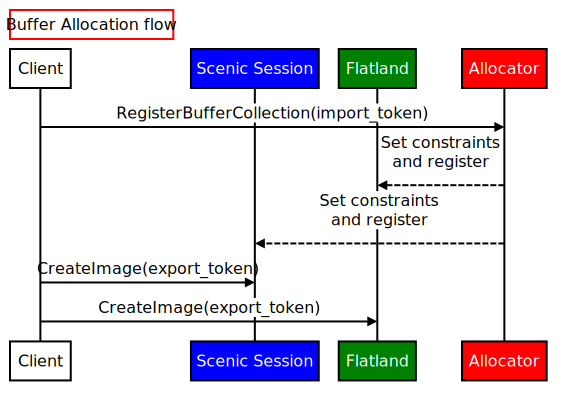

# Scenic Allocator

## Summary

This document proposes a plan to extract Scenic's Image resource allocations into a
seperate protocol.

## Goals and use cases

Allocator API aims to improve the existing Image allocation flows and make it compatible
with the upcoming changes.

  + Extends the scope of allocated BufferCollection resources from Scenic::Session. One
    BufferCollection can be used to create Image resources in multiple Scenic::Sessions,
    and our upcoming 2D API Flatland's sessions.

  + Seperating buffer allocations from Scenic::Session makes the protocols' purpose clear.
    Allocator only deals with buffer allocations, whereas Scenic::Sessions are used for
    presentation and drawing.

  + Allocator can be used by our 3D API as well as the upcoming 2D API. This allows for
    more complex graphics use.

Using this API, more complex users can shared Image resources between their independant
Scenic::Sessions. That is currently not possible and often forces reallocations.

## Design

Our suggestion is mostly a move of buffer registration and deregistration functionality
out of Scenic::Session into a new protocol. See below for the proposed protocol.

```
library fuchsia.ui.composition;

/// A typed wrapper for an eventpair, representing the registry endpoint of a buffer collection.
resource struct BufferCollectionExportToken {
    zx.handle:EVENTPAIR value;
};

/// A typed wrapper for an eventpair, representing the Image import endpoint of a buffer
/// collection.
resource struct BufferCollectionImportToken {
    zx.handle:EVENTPAIR value;
};

protocol Allocator {
    /// A BufferCollection is a set of VMOs created by Sysmem and shared by a number of
    /// participants, one of which is the Flatland Renderer. Some content, such as Images, use a
    /// BufferCollection as their backing memory.
    ///
    /// Clients can send `export_token` to register buffer collections with Allocator to be used
    /// later in [`fuchsia.ui.scenic.internal/Flatland`] instances or other Scenic APIs. For
    /// example, by passing a [`BufferCollectionImportToken`] containing the matching peer of
    /// [`BufferCollectionExportToken`], they can create image resources via
    /// [`fuchsia.ui.scenic.internal/Flatland.CreateImage`]. Clients should wait for the response
    /// before using `import_token`.
    ///
    /// Flatland participates in the allocation of buffers by setting constraints on the
    /// BufferCollection referenced by `buffer_collection_token`. It will not block on buffers
    /// being allocated until the client creates content using the BufferCollection.
    ///
    /// The buffer collection registered with `export_token` is available and kept alive as long
    /// as the client holds a valid [`BufferCollectionImportToken`]. They will be garbage collected
    /// when all [`BufferCollectionImportToken`]s are closed and all the associated Image resources
    /// are released.
    RegisterBufferCollection(BufferCollectionExportToken export_token,
                             fuchsia.sysmem.BufferCollectionToken buffer_collection_token)
        -> () error RegisterBufferCollectionError;
};
```

**Figure 1 - Image creation flow**


Note that buffer deregistration is no longer necessary. This can be implicitly done by dropping
all BufferCollectionImportToken instances on the client side. This is a better guard against
memory leaks considering that many clients had problems doing deregistration flows in an unexpected
shutdown.

The existing buffer registration functionality required client to define a unique id to refer to
the BufferCollection. This is replaced by EVENTPAIR, which clients can easily duplicate as many
times as they want to refer. See the existing flow below.

```
protocol Session {
    RegisterBufferCollection(uint32 buffer_id, fuchsia.sysmem.BufferCollectionToken token);

    DeregisterBufferCollection(uint32 buffer_id);
};
```

The work toward landing suggested design has been going on and the necessary refactors have landed.
See fxr/498558 and fxr/499479 for the actual changes.

## Usability

Allocator API allows a different way to achieve the existing functionality, which is easier
from the clients perspective.

  + Client creates an EVENTPAIR rather than figuring out a unique id.
  + Client can drop the other end of event pair rather than explicitly calling
    DeregisterBufferCollection with the same unique id.
  + Client can duplicate and use the other end of event pair in multiple Scenic::Sessions
    to create Image resources.

See below for an example usage pattern from Scenic::Session.

```
fuchsia::ui::composition::AllocatorPtr scenic_allocator;
fuchsia::sysmem::BufferCollectionTokenSyncPtr token;
auto ref_pair = allocation::BufferCollectionImportExportTokens::New();
scenic::SessionPtr session;
scenic_allocator->RegisterBufferCollection(std::move(ref_pair.export_token), std::move(token),
                                             [&]() {
                                               session->Enqueue(scenic::NewCreateImage3Cmd(
                                                 image_id, width, height,
                                                 std::move(ref_pair.import_token), vmo_index));
                                             });
```

## Testing

We are planning to add extensive unit tests around our API. The integration tests that
requires using allocator in coordination with Scenic::Session can be done by converting
our in-tree pixel tests.

## Performance considerations

Allocator API does not add any additional API calls. It saves the clients from doing an
DeregisterBufferCollection call.

## Security considerations

Allocator API relied on EVENTPAIR functionality to solve security problems. Uniqueness
of EVENTPAIR and strong ties to other endpoint at creation times ensures that a malicious client
cannot hijack and access the underlying buffers. If they were to acquire EVENTPAIR somehow, they
would only be able to present this image, but not modify or read it.

## Drawbacks and alternatives

Allocator API proposal has two main improvements points, either of which can be replaced by the
existing protocols and flows.

  + We could keep using unique id to reference buffer collections instead of event pairs. We could
    expect the client to select a unique collection identifier or we could return a unique
    collection identifier from the registration calls.
    + Picking unique identifiers would require synchronization, both in terms of client finding a
      working identifier and waiting for Allocator's confirmation before using it.
    + Unique identifier could easily be hijacked by a malicious client.
    + We would need explicit DeregisterBufferCollection() calls.
  + We could keep Allocator within Scenic::Session and Flatland instances rather than exposing a new
    protocol.
    + Our complex clients working with multiple sessions would still have the limitation of not
      using buffer collections beyond one session they are registered with.
