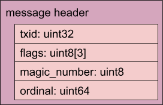



# {{ rfc.name }}: {{ rfc.title }}
<!-- SET the `rfcid` VAR ABOVE. DO NOT EDIT ANYTHING ELSE ABOVE THIS LINE. -->

Note: Formerly known as [FTP](../deprecated-ftp-process.md)-037.

## Summary

This proposal **modifies the wire format** as follows.

The **reserved bytes of the transaction header** are allocated to:

* A one byte **magic number** to identify the wire format used;
* And three bytes for **flags** meant to be temporarily used for soft migrations.

Additionally, rather than shoehorning epitaphs values in the header, an
**epitaph payload is a `struct{int32}`**.

## Motivation and design

Having a magic number in headers:

* Provides a mechanism to readers whether a message received is compatible (or
  note), and symmetrically provide a mechanisn for writers to indicate the
  format of messages sent.
* Ordering of magic numbers is a non-goal, magic numbers should simply checked,
  and if not compatible (i.e. the same), rejected. Specifically, we shy away
  from the term "version" since we want pairwise compatibility checks, and not
  range based compatibility as in "supports v5 through v8".

Having flags in headers:

* Provides a mechanism to help with soft transition, especially the requirement
  that bindings MUST NOT reject messages if they do not know about the use of
  certain flags, and instead just ignore them. For instance, this was used to
  migrate [away from static unions](/docs/contribute/governance/rfcs/0061_extensible_unions.md#implementation_strategy).
* We prefer allocating more bytes to flags (3 bytes) than to magic numbers (1
  byte) as we expect a lot more features to be temporarily needed, than wire
  format flavors.

On epitaph:

* Epitaphs were [shoehorned](/docs/contribute/governance/rfcs/0029_increasing_method_ordinals.md#wire_format) into the `reserved` bytes,
  which are now used for the magic number and the flags;
* Having epitaphs be a plain vanilla payload `struct{int32}` removes one special
  snowflake from the [wire format][wire-format], which typically simplifies
  bindings and reduces the likelihood of bugs or incompatibilities.

Lastly, we want to keep the header as small as possible, and it is an explicit
goal to keep it at 16 bytes all the while supporting the additional requirements
described above.

### Evolution of Transactional Message Header

FIDL2 ("v2"):

* Transaction ID (`uint32`)
* Reserved (`uint32`)
* Flags (`uint32`)
* Ordinal (`uint32`)

[RFC-0053](/docs/contribute/governance/rfcs/0053_epitaphs.md):

* Transaction ID (`uint32`)
* Reserved (`uint32`) OR [Epitaph value
  (zx.status)](/docs/contribute/governance/rfcs/0053_epitaphs.md#wire-format)
* Flags (`uint32`)
* Ordinal (`uint32`)

[RFC-0029](/docs/contribute/governance/rfcs/0029_increasing_method_ordinals.md):

* Transaction ID (`uint32`)
* Reserved (`uint32`) OR [Epitaph value
  (zx.status)](/docs/contribute/governance/rfcs/0053_epitaphs.md#wire-format)
* Ordinal (`uint64`)

Initially, the reserved (`uint32`) field covering bytes 4 through 7 was meant to
align with requirements from [zx_channel_call][zx_channel_call]. However, the
syscall has stabilized, and this requirement is no longer needed.

<!-- xrefs -->
[zx_channel_call]: /docs/reference/syscalls/channel_call.md

### Version 3

We stabilize the transactional message header ("v3") to be:

* Transaction ID (`uint32`)
* Flags (`array<uint8>:3`, i.e. 3 bytes)
* Magic Number (`uint8`)
* Ordinal (`uint64`)

Bindings MUST NOT check flags, except for specific flags these bindings are
using or know about, i.e. it is valid to set a bit that is unknown to recipient
bindings.

As a [wire format diagram][wire-format] we have:

### When should a new magic number be assigned

The initial magic number will be `0x01`. We reserve funnier numbers for later.

A magic number MUST be assigned to a new wire format when the wire format it is
evolving or replacing cannot be reasonably phased out by the FIDL team.

## Performance {#performance}

Having epitaphs be `struct{int32}` payloads, rather than embedded in the
transaction header, increases the minimal amount of bytes read from 16 bytes to
24 bytes Performant bindings stack allocate a small buffer, and an increase of 8
bytes has minimal impact.

<!-- xrefs -->
[wire-format]: /docs/reference/fidl/language/wire-format
