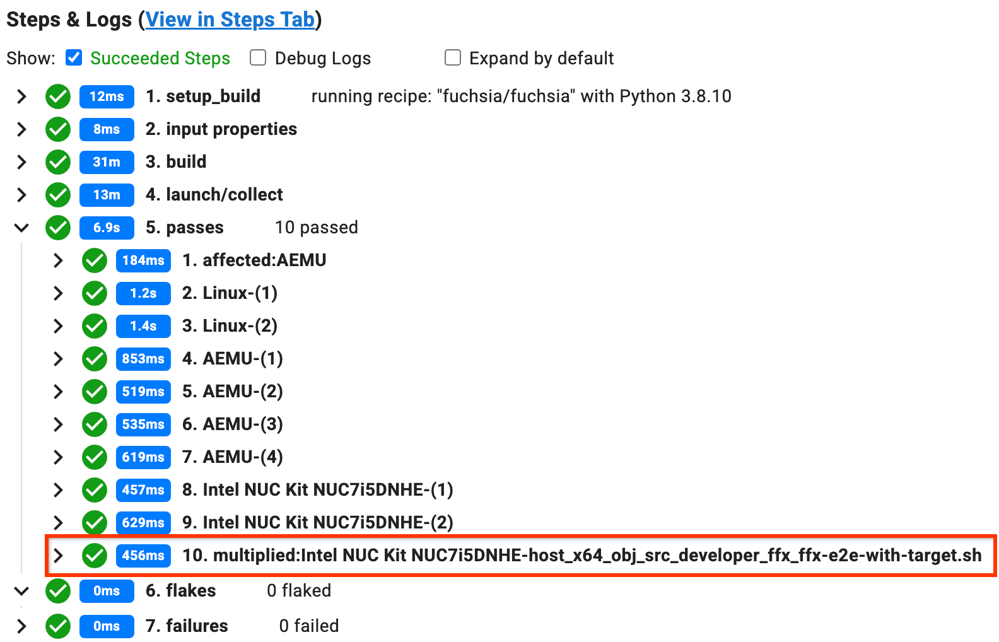

# Testing for flakiness in CQ

To test for flakiness in CQ, the infrastructure can run a test multiple
times and fail the overall build if there is a single failure. This
happens automatically when the infrastructure determines there's a small
number of tests affected by the commit being tested (according to the build
graph).

## Format

A change author can tell the infrastructure to run a specific test many times by
adding a `Multiply` footer to the commit message:

```txt
Multiply: test_selector
```

`test_selector` can be a test name, a substring of a test name, or an
[re2 regular expression](https://github.com/google/re2/wiki/Syntax) that matches
a test name.

Fuchsia component tests are referenced by package URL:

```txt
Multiply: fuchsia-pkg://fuchsia.com/foo_tests#meta/foo_tests.cm
```

Host tests are referenced by path:

```txt
Multiply: host_x64/obj/src/bar_tests.sh
```

Substrings of test names are also accepted:

```txt
Multiply: foo_tests
Multiply: bar_tests
```

Multipliers may be combined into a single comma-separated line:

```txt
Multiply: foo_tests, bar_tests
```

All-caps `MULTIPLY` is also accepted.

Example uses of `Multiply` from real changes:

- [`Multiply: driver_development_test`](https://fuchsia-review.googlesource.com/c/fuchsia/+/677686)
- [`Multiply: ffx_daemon_target_lib_test`](https://fuchsia-review.googlesource.com/c/fuchsia/+/678622)
- [`Multiply: virtual-keyboard-test`](https://fuchsia-review.googlesource.com/c/fuchsia/+/677607)
- [`Multiply: text_manager_integration_test: 10`](https://fuchsia-review.googlesource.com/c/fuchsia/+/671465)

## Run count

By default, the infrastructure uses historical test duration data to calculate a
number of runs. The number of runs is chosen to produce a single multiplied test
shard whose duration is similar to the expected duration of the other shards, up
to a maximum of 2000 test runs. Slower tests will run fewer times, while faster
tests will run more times.

It's sometimes desirable to override the default number of runs (for example,
because the default is too high and causes timeouts). In this case you can
explicitly specify a number of runs.  For example:

```txt
Multiply: foo_tests: 100
```

## Limitations



### Internal tests

Multiplying internal tests on public changes is not allowed, to avoid leaking
confidential information. If you want to multiply an internal test, use `fx
make-integration-patch` to create an internal CL that patches your CL into the
integration repository. Then add the necessary `Multiply` line to the
integration CL instead of the original public CL, and CQ+1 the integration CL.



### Validation

If there is a typo in your `Multiply` clause, or if your `Multiply` selector
doesn't match any tests on any builders, it will silently fail to multiply any
tests.

Therefore, it's important to manually verify that the `Multiply` took effect.
For every builder on which your `Multiply` takes effect, a comment of the
following form will be added to your change in Gerrit:

```txt
A builder created multiplier shards. Click the following link for more details:
```

The comment will include a link to the build that runs the multiplied tests
([example](https://fuchsia-review.googlesource.com/c/fuchsia/+/671465/5#message-e1f2b9db0dfcd1bf8436205c9eff6da0735e10b7)).

If no such comment appears, then there probably is an error with the syntax or
the test does not run in any of the regular CQ builders. In this case, you have
to either add it to the build graph so that it is run by one of the builders or
manually choose the tryjob that runs the test if it's run in an optional
builder.

If the linked build is completed, you should see a step like `multiplied:<shard
name>-<test name>` under one of the `passes`, `flakes`, or `failures` steps. If
the build is not yet completed, you can click on the link under the `build` step
named `<builder name>-subbuild`, which will take you to the subbuild build page
where you should see a similar `multiplied` step. Since the comment doesn't
specify which tests were multiplied, you can look at the build pages to confirm
(in case you multiplied more than one test).

For example:



### No more than five matching tests

A single multiplier is not allowed to match more than five tests, to prevent
change authors from accidentally multiplying a huge number of tests and
overwhelming the testing infrastructure.

If you get a tryjob failure as a result of a `Multiply` statement that matches
too many tests, simply edit your commit message locally or in the Gerrit UI to
make your test selector more specific. Then retry CQ.

### Changing `Multiply` after a CQ dry run passes

If all tryjobs have already passed a CQ dry run and you add or edit a `Multiply`
clause without making any code changes, subsequent CQ+1 or CQ+2 attempts within
24 hours of the dry run will not re-run the builders and the updated `Multiply`
clause will not be respected.

This is because the CQ service treats commit message updates as "trivial" and
does not invalidate past CQ attempts on the patchset.

To work around this, you can either:

- Manually retry a subset of tryjobs using the **Choose Tryjobs** menu and wait
  for them to pass before submitting.
- OR retry all tryjobs by making a non-functional code change (e.g. add a
  comment to some code) and uploading a new patchset to invalidate the old
  tryjob results. Then retry CQ with the `Multiply` footer present.

### Timeouts

The default run count for a multiplied test is based on the historical duration
of the test. If your change increases the duration of a multiplied test, the
default run count may be too high and cause the task running the test to time
out and not report any results.

In this case, you should override the default run count by manually specifying a
lower run count, e.g.:

```txt
Multiply: foo_tests: 30
```

### No test case multipliers

`Multiply` only supports multiplication of top-level suites (Fuchsia test
packages and host test executables). All test cases within a multiplied test
suite will be multiplied.

There is no way to multiply a single test case within a test suite.
