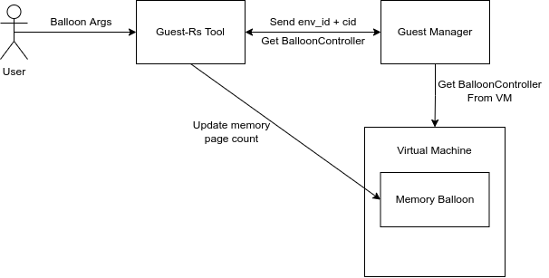
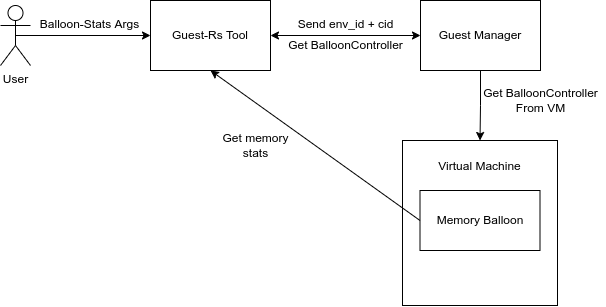
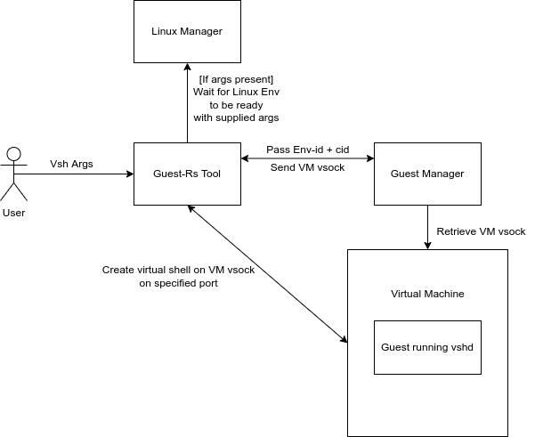
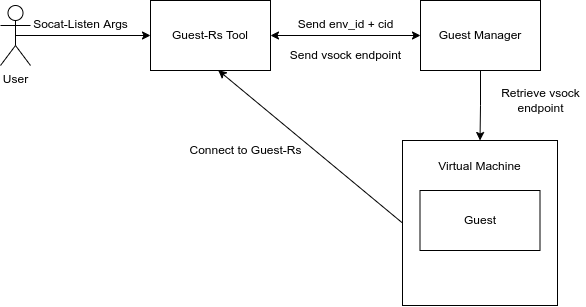

# Fuchsia Guest Tool
Welcome to the Fuchsia Virtualization Guest tool. This document covers the basic structure of how
our command-line interface (CLI) tool works, so that you can make full use of it and extend it to
fit your needs!

## Commands and Usage
### Launch
The `launch` command creates an interactive session with a new Virtual Machine running the
specified package.

#### Arguments
`guest launch package [--cmdline-add <arg>...] [--interrupt <interrupt>...]`
`[--default-net <bool>] [--memory <memory-size>] [--cpus <num-cpus>] [--virtio-* <bool>]`

**Example**: `guest launch zircon_guest --default-net false --virtio-gpu true`

**Positional Arguments**
- `package: String`: The package to use for the Guest operating system,
   such as `zircon_guest` or `debian_guest`.

**Optional Arguments**
- `cmdline-add: String`: Argument to add to the Guest kernel command line.
    This option is repeatable to add multiple arguments.
- `default-net: bool`: Whether to enable a default network device.
    The default value is **true**.
- `memory: u64`: Amount of memory, in bytes, to provide the Guest.
- `cpus: u8`: Number of virtual cpu's provided to the Guest.
- `interrupt: u32`: Adds a hardware interrupt mapping to the Guest.
    This option is repeatable to add multiple interrupt mappings.
- `virtio-balloon: bool`: Whether to enable `virtio-balloon` for the Guest.
    The default value is **true**.
- `virtio-console: bool`: Whether to enable `virtio-console` for the Guest.
    The default value is **true**.
- `virtio-gpu: bool`: Whether to enable `virtio-gpu` for the Guest. The default value is **true**.
- `virtio-rng: bool`: Whether to enable `virtio-rng` for the Guest. The default value is **true**.
- `virtio-sound: bool`: Whether to enable `virtio-sound` for the Guest.
    The default value is **true**.
- `virtio-sound-input: bool`: Whether to enable `virtio-sound-input` for the Guest.
    The default value is **false**.
- `virtio-vsock: bool`: Whether to enable `virtio-vsock` for the Guest.
    The default value is **true**.
#### Structure
The `launch` command serves as an intermediary between the end user and the Guest Manager.
The end user provides the specified arguments (shown above) for how they wish the Guest to be
configured, which are parsed by the `guest` tool. The parsed arguments and then sent to the
Guest Manager via FIDL, which spawns a vmm (Virtual Machine Monitor) component and supplies a FIDL
connection to the `guest` tool for communicating with the spawned Guest.

The Virtual Machine (VM) is communicated with to retrieve sockets connected to the Guest's serial
port and terminal. These sockets are treated as data streams within `guest`, processing
information read from these sockets and writing user input back to the VM (which then passes the
information to the Guest), enabling an interactive session to occur.


### List
The `list` command allows for viewing of all currently running VMs.

#### Arguments
`guest list`

**Example output**:
```guest list
env:0 zircon_guest
guest:3 fuchsia-pkg://fuchsia.com/zircon_guest#meta/zircon_guest.cmx
```

#### Structure
The `list` command connects to the Guest Manager via FIDL, and queries for a list of all currently
running VMs on Fuchsia. These environments contain information about all VMs running within them,
in the form of `context-id, label` pairs, where the label is the name of the package running in the
VM. The values outputted by this command are used as arguments for other commands of the tool;
in the above example, `env_id` is `0` and the `cid` for the VM listed is `3`. This could then be
used in other commands, such as `guest balloon-stats 0 3` (see `balloon-stats`).


### Balloon
The `balloon` command allows for modifying the size of a memory balloon. See `virtio-balloon.cc`
for more on the Balloon device.
#### Arguments
`guest balloon env-id cid num-pages`

**Example**: `guest balloon 1 2 3`

**Positional Arguments**
- `env-id: u32`: Environment id number that homes the VM you are trying to modify. See `list` for
    how to find this value.
- `cid: u32`: Context id number for the VM you are trying to modify. See `list` for how to find
    this value.
- `num-pages: u32`: Number of memory pages the balloon will have after this operation.

#### Structure
The `balloon` command is used for modifying the size of a memory balloon. The `guest` tool takes
the above arguments to locate the VM that is to be modified, and the new size for the associated
memory balloon (which will shrink or grow depending on the value automatically). It provides the
Guest Manager with the identifiers inputted via FIDL, and upon successful location, is provided the
VM's `BalloonController` from the Guest Manager. This controller is used by `guest` to directly
talk to the VM balloon via FIDL to modify the page number of the memory balloon.



### Balloon Stats
The `balloon-stats` command allows for viewing the current statistics of a memory balloon.
#### Arguments
`guest balloon-stats env-id cid`

**Example**: `guest balloon-stats 0 10`

**Positional Arguments**
- `env-id: u32`: Environment id number that homes the VM you are trying to modify. See `list` for
    how to find this value.
- `cid: u32`: Context id number for the VM you are trying to modify. See `list` for how to find
    this value.

#### Structure
The `balloon-stats` command functions almost identically to the `balloon` command in terms of how
it locates the VM through the provided input arguments, however rather than requesting the number
of memory pages be changed through the `BalloonController` over FIDL, instead a FIDL request is
made to retrieve a vector of `MemStat`s, which detail the statistics for the fields of a memory
balloon through `tag, value` pairs.
These tags are detailed here:
```
"swap-in": Amount of memory swapped into balloon
"swap-out": Amount of memory swapped out of balloon
"major-faults": Amount of major faults so far
"minor-faults": Amount of minor faults so far
"free-memory": Amount of free memory in balloon
"total-memory": Amount of memory total in balloon
"available-memory": Amount of memory as in /proc
"disk-caches": Amount of disk caches
"hugetlb-allocations": Amount of hugetlb allocations
"hugetlb-failures": Amount of hugetlb allocation failures
```



### Serial
The `serial` command allows for interacting with a Guest over a serial connection.

#### Arguments
`guest serial env-id cid`

**Example**: `guest serial 1 3`

**Positional Arguments**
- `env-id: u32`: Environment id number that homes the VM you are trying to interact with.
    See `list` for how to find this value.
- `cid: u32`: Context id number for the VM you are trying to interact with. See `list` for how to
    find this value.

#### Structure
The `serial` command provides a convenient way to interact with a VM through a serial connection.
This is useful for when you wish to access the serial port for a running VM, for example.
The `guest` tool takes an environment identifier and a context identifier that identifies a VM,
which are provided to the Guest Manager. Upon successful location, the `guest` tool is provided
with a FIDL connection to the VM, which is then queried for a serial socket. The `guest` tool
takes this socket and begins an interactive session over serial only, similar to the process in `launch`.


### Vsh (Virtual Shell)

The `vsh` command allows for creating a virtual shell to a guest.

#### Arguments
`guest vsh [env_id [cid [port]]] [--args <arg>]`

**Example**: `guest vsh 0 2 2222 --args penguin`

**Positional Arguments**
- `env-id: u32`: Environment id number for where the VM is currently running. See `list` for how
    to find this value.
- `cid: u32`: Context id number for the VM hosting the virtual shell you wish to connect to.
    See `list` for how to find this value.
- `port: u32`: Port for where a currently running virtual shell is running on.

**Optional Arguments**
- `args: String`: Argument to provide to the argv of virtual shell. This argument is repeatable to
    add additional arguments. Leave blank for default shell.

#### Structure

_**It is important to note** that this command requires a `vshd` server is run in the Guest prior_
_to use, which as of writing is currently only true for `termina`._

The `vsh` command is the primary way of interacting with guests over a virtual shell. The end user
provides `guest` with optional values for the environment, context, and port that identify a
vsock connection for `vsh` to create a new virtual shell on, with defaults provided in their
absence. These defaults are described below:

- `env-id`: Defaults to Linux environment, if available, else the first environment in the VMM's
    list.
- `cid`: Defaults to Linux Guest cid, if available, else the first cid in the list of instances
    in the environment specified.
- `port`: Defaults to 9001 if no port given.

Regardless of if these values are specified or not, the `guest` tool will attempt to create a
new virtual shell in the specified VM that contains a Guest running a `vshd` server. Upon successful
location of such a VM, `guest` will launch a new virtual shell to allow interaction with the
Guest. Default arguments are provided to the virtual shell if none are specified through `--args`.

If arguments _are_ specified via `--args`, additional functionality is executed by `guest`;
namely, the `guest` tool will wait for the Linux environment to be ready before continuing to
connect to the Guest as described above. This process is displayed to the end user until either the
`LinuxManager` (a separate manager from the Guest Manager) reports success or failure; on failure,
the user is prompted if they would like to try again (failure may occur for a few reasons, most
notably internet connection issues).



### Socat (**Soc**ket **cat**)
The `socat` command. allow for creating a vsock connection on `cid:port` in `env_id`. Data received
on the socket will be sent to `stdout` and data from `stdin` will be sent over the socket.

#### Arguments
`guest socat env-id cid port`

**Example**: `guest socat 0 3 2222`

**Positional Arguments**
- `env-id: u32`: Environment id number for where the VM is currently running. See `list` for how to
    find this value.
- `cid: u32`: Context id number for the VM. See `list` for how to find this value.
- `port: u32`: Port on `cid` to connect to.

#### Structure
The `socat` command is the used to create a vsock connection in a running VM. The end user provides
`guest` with identifiers to find the VM hosting a listener server, and a port to connect to.
The `guest` tool sends these identifiers to the Guest Manager via FIDL, being returned a FIDL
connection to the environment specified. The tool then creates an interactive session through a
socket, with data received being sent to `stdout` and input from `stdin` sent to the host.


### Socat Listen
The `socat-listen` command allows for listening on a vsock `port` within `env_id` on the
host `cid` (`2`).

#### Arguments
`guest socat-listen env-id host-port`

**Example**: `guest socat-listen 0 2222`

**Positional Arguments**
- `env-id: u32`: Environment id number for where a socat connection is running.
- `port: u32`: Port to listen on.

#### Structure
The `socat-listen` command is used to listen on a vsock port on the host endpoint (`cid 2`),
acting as a server for a vsock connection. The end user provides `guest` with the environment
and port they wish to have this server listen on, as the `cid` will always be set to the
host `cid`.

Once `guest` is successfully able to listen on a port, it starts as a server. The server will
run until it accepts one connection, at which point a session will begin between the client and
server (see `socat`). Once this connection closes, the server is shut down and the process exits.


